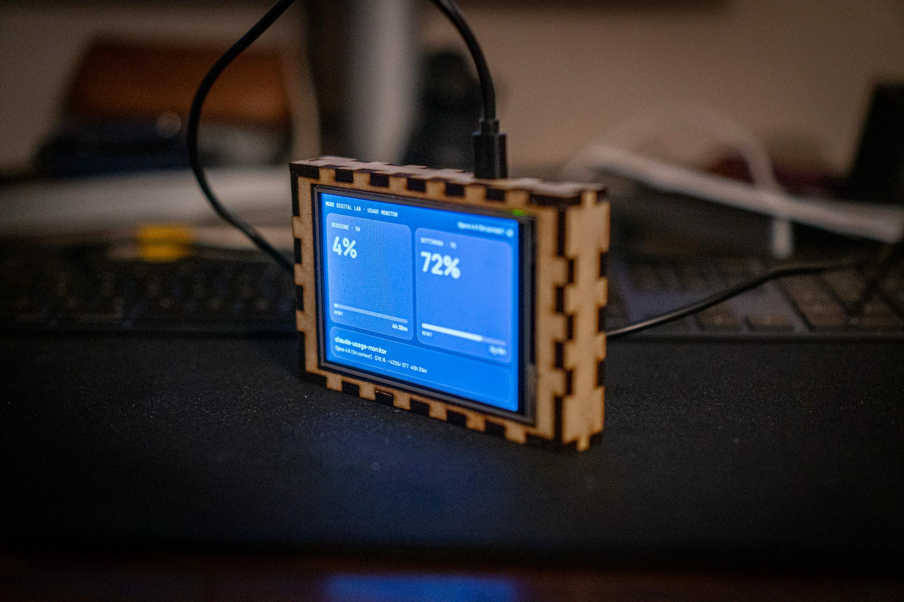

# Claude Usage Monitor — More Digital Lab

*English version: [README.md](README.md)*

Monitor in LAN del consumo dell'abbonamento Claude (gli stessi dati del comando
`/usage` di Claude Code), servito da un Raspberry Pi Zero W come pagina web
responsive in stile More Digital Lab.

**Da dove partire:**
- Guida passo-passo per tutti: [`docs/tutorial.html`](docs/tutorial.html)
  (aprila nel browser)
- Questo README: dettagli tecnici, setup manuale, architettura
- Hai un agente AI (es. Claude Code)? Digli *"leggi AGENTS.md e installa il
  monitor"*: [`AGENTS.md`](AGENTS.md) è il runbook scritto per lui

## Come funziona

```
Mac (Claude Code)                      Raspberry Pi Zero W
┌─────────────────────────┐            ┌──────────────────────────┐
│ statusline-forward.sh   │  POST JSON │ server.py (porta 8787)   │
│ (invocato dalla         ├───────────►│  · salva ultimo payload  │
│  statusline, max 1/15s) │            │  · serve index.html      │
└─────────────────────────┘            └──────────┬───────────────┘
                                                  │ GET ogni 30s
                                       ┌──────────▼───────────────┐
                                       │ browser in LAN           │
                                       │ http://<pi>:8787         │
                                       └──────────────────────────┘
```

Claude Code (v2.1.80+) passa allo script di statusline un JSON che include
`rate_limits` (percentuale finestra 5 ore, percentuale settimanale, orari di
reset) più dati di sessione (nome, repo, costo, contesto, righe, durata). Lo
script lo inoltra al Pi e poi stampa la statusline: quella dell'utente se
configurata, altrimenti una riga minimale integrata (modello + percentuali).
Il server tiene traccia di ogni sessione Claude Code attiva (per `session_id`,
scarto dopo 30 minuti di silenzio) e la pagina mostra una card per ciascuna.

I dati si aggiornano mentre Claude Code è in uso: è l'unico momento in cui le
percentuali cambiano. Da fermo, la pagina continua a mostrare l'ultimo valore
e i countdown al reset, calcolati in locale. Nessun token OAuth viene estratto
o riutilizzato: si usa solo il meccanismo ufficiale della statusline.

## Installazione rapida (consigliata)

Sul **Raspberry Pi** (qualsiasi modello, serve solo Python 3, preinstallato):

```sh
# se 'git: command not found': sudo apt update && sudo apt install -y git
git clone https://github.com/landoxfpv/claude-usage-monitor && cd claude-usage-monitor
./install-pi.sh
```

Copia i file, genera il servizio systemd con il tuo utente e i tuoi path,
lo avvia e lo abilita al boot, poi stampa l'indirizzo della pagina.

Sul **computer con Claude Code** (macOS o Linux):

```sh
./install-client.sh raspberrypi.local     # o l'IP del Pi
```

Installa il forwarder in `~/.claude/usage-monitor/`, configura la statusline
in `settings.json` e — se ne avevi già una personalizzata — **la preserva
automaticamente**: il forwarder continuerà a delegarle la stampa. Rilanciarlo
è sicuro (idempotente), ad esempio per cambiare l'indirizzo del Pi.

Lancia gli installer come utente normale, **non con `sudo`**:
chiedono sudo da soli dove serve, e si rifiutano di partire come root
(altrimenti i file finirebbero in `/root` e il servizio girerebbe come root).

## Setup manuale Raspberry Pi

Requisiti: Raspberry Pi OS con Python 3 (preinstallato), nessuna dipendenza.

```sh
# dal Mac
scp -r pi/ pi@raspberrypi.local:/home/pi/claude-usage-monitor

# sul Pi
ssh pi@raspberrypi.local
sudo cp /home/pi/claude-usage-monitor/claude-usage.service /etc/systemd/system/
sudo systemctl daemon-reload
sudo systemctl enable --now claude-usage
systemctl status claude-usage        # deve risultare active (running)
```

Se l'utente del Pi non è `pi`, aggiorna `User=` e i path nel file `.service`.

La pagina è su **http://raspberrypi.local:8787** (o `http://<ip-del-pi>:8787`).

## Setup manuale computer con Claude Code (Mac/Linux)

1. Copia `mac/statusline-forward.sh` dove preferisci e rendilo eseguibile
   (`chmod +x`).

2. In `~/.claude/settings.json` imposta la statusline sullo script:

   ```json
   "statusLine": {
     "type": "command",
     "command": "bash \"/percorso/assoluto/statusline-forward.sh\""
   }
   ```

3. (Opzionale) Crea `~/.claude/usage-monitor.env`:

   ```sh
   # dove inviare i dati (default: http://raspberrypi.local:8787/api/usage)
   PI_URL=http://192.168.1.xx:8787/api/usage

   # se avevi già una statusline personalizzata, lo script le delega la stampa;
   # senza questa riga stampa una riga minimale (modello + % usage + cartella)
   STATUSLINE_CMD='node /percorso/alla/tua/statusline.js'
   ```

Lo script inoltra il JSON al Pi con throttle di 15s, timeout 2s e in
background: la statusline non viene mai rallentata, e se il Pi è spento il
forward fallisce in silenzio. Per disinstallare: rimuovi il blocco
`statusLine` da `settings.json` (o rimettici la tua statusline precedente).

## Display dedicato sul Pi (kiosk)

Se al Pi è collegato uno schermo, un secondo installer opzionale mostra la
dashboard direttamente lì, all'accensione:

```sh
./install-kiosk.sh
```

Riconosce il tuo Pi e propone uno dei due motori (Invio conferma):

- **Chromium** — la stessa pagina web a schermo intero, tramite il
  compositor Wayland minimale `cage`. Per Pi 3/4/5 e Zero 2 W; gli schermi
  HDMI funzionano senza configurazione.
- **Renderer nativo** — un piccolo processo Python che disegna direttamente
  sul framebuffer, niente X e niente browser. Stesso design, refresh a 1 s.
  È il motore per il Pi Zero W originale e per i pannelli GPIO/SPI.

I pannelli GPIO/SPI (shield 3.5" ST7796S, oppure un modulo 4.0" ST7796S
cablato a mano) richiedono prima un driver del kernel, così che `/dev/fb1`
esista prima che il renderer nativo possa disegnarci — vedi
[docs/display-st7796s.md](docs/display-st7796s.md). Copre i concetti
(framebuffer vs DRM, le trappole di modeset e retroilluminazione) e due ricette
verificate: `fbtft`/LCD-show per lo shield 3.5" e `panel-mipi-dbi` (provata su
Pi Zero W + Raspberry Pi OS Trixie) per il pannello 4.0". Rilancia l'installer
per cambiare motore o framebuffer; per rimuoverlo:
`sudo systemctl disable --now claude-kiosk`.

### Case tagliato al laser



Un contenitore a incastri (finger-joint) per il pannello 4.0" + Pi Zero. I file
di taglio sono in [`Lasercut-box/`](Lasercut-box/): `Lasercut.svg` è il foglio
vettoriale (~256×136 mm; scala secondo il tuo materiale), `Lasercut.png` mostra
l'anteprima e `Engraving_text.png` è l'incisione frontale. Altre foto del build
in [`Foto/`](Foto/).

## Test rapido senza Pi

```sh
cd pi && python3 server.py &
curl -X POST http://localhost:8787/api/usage -H 'Content-Type: application/json' \
  -d '{"model":{"display_name":"Test"},"rate_limits":{"five_hour":{"used_percentage":42,"resets_at":1751730000}}}'
open http://localhost:8787
```

## Roadmap

- **Immagine SD pronta da flashare** (Balena Etcher / Raspberry Pi Imager):
  build automatica con pi-gen in GitHub Actions, con firstboot che legge la
  config WiFi da un `wifi.txt` nella partizione boot (su Raspberry Pi OS
  Bookworm il vecchio `wpa_supplicant.conf` non funziona più). Richiede test
  su hardware reale prima della release.
- One-liner `curl | bash` per gli installer, una volta pubblicato il repo.

## Note

- La persistenza su disco (`data.json`) è limitata a una scrittura al minuto
  per preservare la SD del Pi; il dato live resta in memoria.
- Il server è pensato per la LAN: non esporlo su internet (nessuna auth). Il
  payload inoltrato include informazioni di lavoro (path delle cartelle, nome
  repo, nome sessione): restano sulla tua rete, ma tienine conto.
- Se la pagina mostra "Payload ricevuto, ma senza rate_limits", aggiorna
  Claude Code sul Mac: i dati di /usage nella statusline richiedono v2.1.80+.
- Se riscrivi la microSD del Pi, il successivo `ssh` rifiuterà la connessione
  con `WARNING: REMOTE HOST IDENTIFICATION HAS CHANGED`. È normale — il nuovo
  OS ha generato nuove chiavi SSH, non è un attacco. Rimedio:
  `ssh-keygen -R raspberrypi.local` (o l'IP che usi), riconnettiti e rispondi
  `yes`.
- I warning di locale al login su un Pi appena installato (`setlocale:
  LC_CTYPE: cannot change locale`) sono cosmetici e ignorabili. Per
  eliminarli: `sudo raspi-config` → Localisation Options, oppure
  `sudo apt install -y locales-all`.
