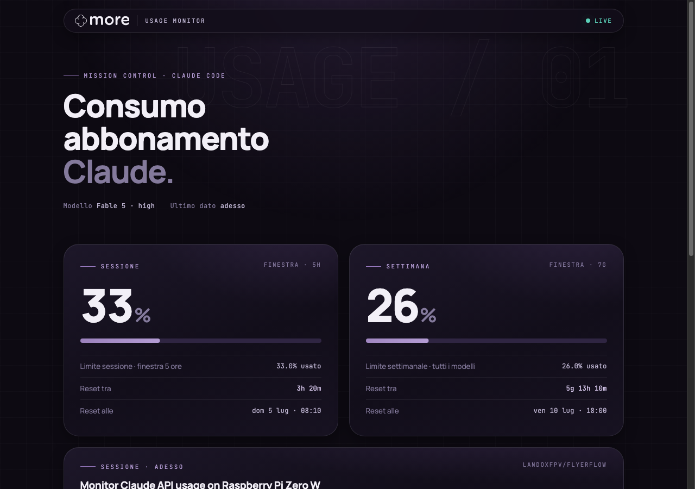
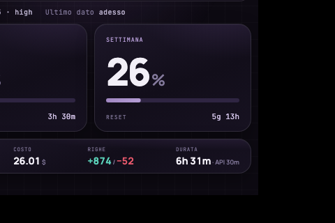

# Claude Usage Monitor

A LAN-only dashboard for your Claude subscription usage — the same data shown
by Claude Code's `/usage` command (5-hour session window, weekly limit, reset
times), served by a Raspberry Pi as a responsive web page. Designed to sit on
your desk and stay out of your way.



Small screens get a dedicated kiosk layout (tested at 480×320), with big
numbers and active sessions rotating every 10 seconds:



## Why this approach

There is no public API for Claude subscription limits. Instead of scraping
OAuth tokens or undocumented endpoints, this project uses the **official
statusline mechanism**: Claude Code (v2.1.80+) pipes a JSON payload to your
statusline command on every update, and that payload includes `rate_limits`
plus session data (name, git repo, cost, context usage, lines changed,
duration). A tiny forwarder script relays it to the Pi. No tokens ever leave
your machine, no data leaves your LAN.

```
Computer (Claude Code)                 Raspberry Pi
┌─────────────────────────┐            ┌──────────────────────────┐
│ statusline-forward.sh   │  POST JSON │ server.py (port 8787)    │
│ (invoked by the         ├───────────►│  · tracks live sessions  │
│  statusline, ≤ 1/15s)   │            │  · serves index.html     │
└─────────────────────────┘            └──────────┬───────────────┘
                                                  │ GET every 30s
                                       ┌──────────▼───────────────┐
                                       │ any browser on your LAN  │
                                       │ http://<pi>:8787         │
                                       └──────────────────────────┘
```

The server tracks every active Claude Code session by `session_id` (dropped
after 30 minutes of silence) and the page renders a card per session. Numbers
update only while Claude Code is working, which is the only time they can
change; when idle, the page keeps showing the last known values and the reset
countdowns, computed locally.

## Quick start

On the **Raspberry Pi** (any model — a Pi Zero W is plenty; Python 3 is
preinstalled on Raspberry Pi OS, no dependencies needed):

```sh
# if 'git: command not found': sudo apt update && sudo apt install -y git
git clone https://github.com/landoxfpv/claude-usage-monitor
cd claude-usage-monitor
./install-pi.sh
```

Optional, if a display is attached to the Pi: `./install-kiosk.sh` (see
"Dedicated display" below).

On the **computer running Claude Code** (macOS or Linux):

```sh
git clone https://github.com/landoxfpv/claude-usage-monitor
cd claude-usage-monitor
./install-client.sh raspberrypi.local     # or the Pi's IP
```

The client installer patches `~/.claude/settings.json` and, if you already had
a custom statusline, **preserves it automatically** (the forwarder keeps
delegating rendering to it). Re-running the installer is safe and is the way
to change the Pi address later.

Run both installers as your regular user, **not with `sudo`**: they ask for
sudo on their own where needed, and refuse to run as root (otherwise files
would land in `/root` and the service would run as root).

Then open `http://raspberrypi.local:8787` from any device on your network and
start a new Claude Code session.

## Documentation

- **[docs/tutorial.html](docs/tutorial.html)** — step-by-step guide for
  non-technical users, from flashing the SD card onward (Italian; translations
  welcome)
- **[README.it.md](README.it.md)** — this README in Italian, with the manual
  (no-installer) setup steps
- **[AGENTS.md](AGENTS.md)** — a runbook written for AI agents: tell your
  Claude Code *"read AGENTS.md and install the monitor"* and it will do the
  whole thing for you

## Manual setup

See [README.it.md](README.it.md) for the full manual steps (scp + systemd on
the Pi, statusline configuration on the computer). In short: `pi/server.py` is
a zero-dependency Python HTTP server you can run any way you like, and
`mac/statusline-forward.sh` is the statusline command to configure in
`~/.claude/settings.json`, with optional config in `~/.claude/usage-monitor.env`:

```sh
PI_URL=http://192.168.1.xx:8787/api/usage
STATUSLINE_CMD='node /path/to/your/statusline.js'   # only if you had one
```

## Dedicated display on the Pi (kiosk)

If a screen is attached to the Pi itself, an optional second installer makes
the dashboard appear on it at boot:

```sh
./install-kiosk.sh
```

It detects your Pi and proposes one of two engines (Enter accepts):

- **Chromium** — the same web page full-screen, via the minimal `cage`
  Wayland compositor. For Pi 3/4/5 and Zero 2 W; HDMI screens work out of
  the box.
- **Native renderer** — a small Python process drawing straight to the
  framebuffer, no X and no browser. Same design, 1 s refresh. This is the
  engine for the original Pi Zero W, and for GPIO/SPI panels.

GPIO/SPI panels (e.g. 3.5" ST7796S shields) need a kernel driver first —
see [docs/display-st7796s.md](docs/display-st7796s.md). Re-run the installer
to switch engine or framebuffer; remove with
`sudo systemctl disable --now claude-kiosk`.

## Quick test without a Pi

```sh
cd pi && python3 server.py &
curl -X POST http://localhost:8787/api/usage -H 'Content-Type: application/json' \
  -d '{"model":{"display_name":"Test"},"rate_limits":{"five_hour":{"used_percentage":42,"resets_at":1751730000}}}'
open http://localhost:8787
```

## Notes and limitations

- The weekly Opus/Fable-specific bar shown by `/usage` is not present in the
  statusline payload (as of Claude Code 2.1.x), so the monitor shows the
  session and all-models weekly windows. If Anthropic adds more windows to the
  payload, they will appear as extra cards automatically.
- The server has no authentication: it is meant for your LAN. Do not expose it
  to the internet. The forwarded payload includes working paths, repo and
  session names.
- Disk writes on the Pi are throttled to one per minute to preserve the SD
  card; live data stays in memory.
- Session cost is the API-equivalent value of your usage, not an actual charge
  on a subscription plan.
- If you re-flash the Pi's SD card, the next `ssh` will refuse to connect
  with `WARNING: REMOTE HOST IDENTIFICATION HAS CHANGED`. That is expected —
  the fresh OS generated new SSH keys, it is not an attack. Fix:
  `ssh-keygen -R raspberrypi.local` (or the IP you use), reconnect, answer
  `yes`.
- Locale warnings when logging into a fresh Pi (`setlocale: LC_CTYPE: cannot
  change locale`) are cosmetic and safe to ignore. To silence them:
  `sudo raspi-config` → Localisation Options, or
  `sudo apt install -y locales-all`.

## Roadmap

- Flashable SD image (Balena Etcher-ready) built with pi-gen in GitHub
  Actions, with a firstboot that reads WiFi credentials from a `wifi.txt` on
  the boot partition.
- `curl | bash` one-liners for both installers.
- English version of the tutorial.

## License

MIT — see [LICENSE](LICENSE). The "More Digital Lab" name and logo are
trademarks of More Digital Lab and are not covered by the code license: if you
fork this into your own product, swap in your own branding.
